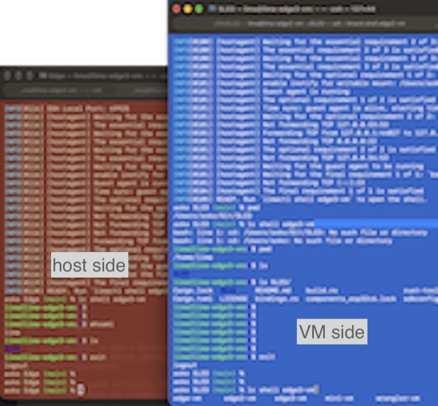

# Edge

<!-- tbd. image of a blade

-->


Collection of Lima VMs.

- [edge-vm](./edge-vm/)

	For Rust embedded development; targeting the [ESP32-C6](https://documentation.espressif.com/esp32-c6_datasheet_en.html).

	- Embassy
	- ESP-IDF; esp-idf-hal, esp-idf-sys, esp-idf-svc
	- USBIP client support

- [mini-vm](./mini-vm/)

	For Linux development, including:
	
	- Rust, 
		- including WASM target
	- node.js, npm

<!-- tbd.
- [cloud-vm](./cloud-vm/)

	For cloud development, including:
	
	- Rust, 
		- with WASM target (for Cloudflare workers)
	- node.js, npm

-->
- ...

You can do your own setups easily, or use these as-is.


## Requirements

<!--
The author develops this on macOS `aarm64`. Using on Linux and/or Windows host is likely possible, but not tested.
-->

- GNU Make (3.81)

	Part of Apple Command Line Tools:
	
	```
	% xcode-select --install
	```

<!-- Developed on:
- macOS 27 Beta
- Lima VM 2.2.0
-->


## Steps


>Note: Read the `README` in the particular subfolder as well. They have additional data!

### Create a VM environment

```
% make edge
limactl start --name=edge-vm --mount-none -y  -- edge-vm/project.yaml
[...]
INFO[0001] The instance edge-vm has shut down           
```

>The instance is stopped so that you can mount work folders to it. This is intended to be changed, having a `custom.mounts` file, from which folders are to be automatically mounted. <!-- tbd. edit once done -->

```
% limactl list
NAME           STATUS     SSH                VMTYPE    ARCH       CPUS    MEMORY    DISK     DIR
edge-vm       Stopped    127.0.0.1:49925    vz        aarch64    4       8GiB      40GiB    ~/.lima/edge-vm
```

>Note the ssh port (49925). It's important you use a separate port for each VM you run (e.g. in the 49922.. range).

### Mount the working folder(s)

The VM has been left in a stopped state with no host side folders shared. This allows you to edit its definition and add the shares.

Plan which folders you'd like to map. You can also add more later by stopping the VM (`limactl stop edge-vm`) and editing again.

|host|VM|
|---|---|
|`/Users/xxx/Git/Some`|`/home/lima/Some`|
|`/Users/xxx/Git/Other`|`/home/lima/Other`|
|...|

```
% limactl edit edge-vm

# Scroll to the end of the YAML and replace the file 'mounts: null' with e.g.
mounts:
  - location: "/Users/xxx/Git/SLED"
    mountPoint: "/home/lima/SLED"   
    writable: true
```

Save and exit.

```
? Do you want to start the instance now?  (Y/n) 
```

`Y`

```
...
INFO[0120] READY. Run `limactl shell edge-vm` to open the shell. 
```

```
% limactl shell --workdir /home/lima edge-vm
```

>Note: Without the `--workdir` parameter, `limactl` tries to `cd` to the path of your host side, which does not exist because of our sandboxing.

You are now in the VM's Linux prompt:

```
lima@lima-edge-vm:~$
```

With this setup, you can already build software for ESP32's. If you also wish to flash the devkit, check the instructions in [`edge-vm/README.md`](./edge-vm/README.md).


### Exiting the VM

To exit, just:

```
$ exit
```


## Advanced

### Terminal profiles

The author likes to use a separate macOS terminal profile (right click > `Show inspector`) for the VMs. This helps keep the host side and VM side apart.




### Renaming VM instances

Our `Makefile` does not support giving arbitrary names to the VM - this is partly by intention. If you have an older instance you might want to keep around, you can:

```
% limactl rename edge-vm edge-vm.was
```

## Summary

You now have:

- a VM running for Rust development


### Next

Have a look at the individual `README`s for the subfolders you will be using. They give more details about working with a certain development setup.

<!--
## References

...
-->
