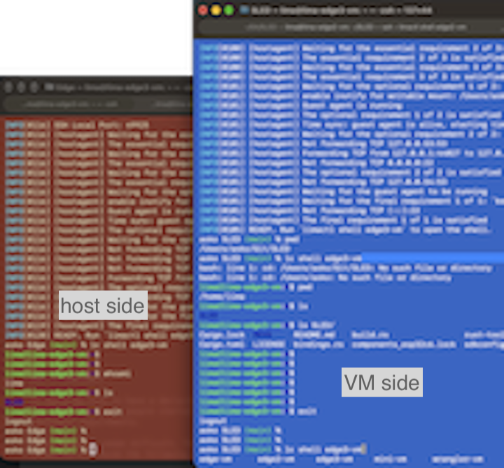

# Edge

<!--

-->

<div style="display: inline-block; filter: drop-shadow(0px 6px 10px rgba(0, 0, 0, 0.4));">
  
</div>

<!-- AI prompt (Google Imagegen):
Haluaisin luoda kuvan GitHub-reponi mieleenpainumisen parantamiseksi.

Repo on nimeltään "EdgeVM" ja se luo mm. sulautetulle kehittäjälle sopivan Lima virtuaalikoneen. Näen tämän siten, että kyseessä on ikäänkuin luistimen terävä reuna, jonka varassa koko loppupeli on. :)

Eli:

Kuva, jossa luistimen reuna viiltää jäätää ja siitä ehkä irtoaa hilettä. Tavoiteltavat aspektit: dynaaminen, hallittu peliliike.
-->

Collection of Lima VM recipes.

### [edge-vm](./edge-vm/)

For Rust embedded development; targeting the [ESP32-C6](https://documentation.espressif.com/esp32-c6_datasheet_en.html).

- ESP-IDF: `esp-idf-hal`, `esp-idf-sys`, `esp-idf-svc`
- `espflash` remoting
- Embassy

<!-- NOPE
- USBIP client support
-->

### [docker-vm](./docker-vm/)

For Docker.

>Note: Also check out [Colima](https://colima.run).


### [mini-vm](./mini-vm/)

For Linux development:
	
- Rust, including WASM target
- node.js, npm


<!-- tbd.
### [cloud-vm](./cloud-vm/)

For cloud development, including:
	
- Rust, 
	- with WASM target (for Cloudflare workers)
- node.js, npm
-->

You can do your own setups easily, or use these as-is.


## Requirements

- GNU Make (3.81)

	Part of Apple Command Line Tools:

	```
	% xcode-select --install
	```

<!-- Developed on:
- macOS 27
- Lima VM 2.3.0
-->

>Currently only tested on macOS.


## Steps

>Note: Read the `README` in the particular subfolder as well. They have additional instructions.

Below, we start the `edge-vm` virtual machine. The steps are similar for all of them (`docker-vm`, `mini-vm`).


### Create a VM environment

```
% make edge
[...]
lima@lima-edge-vm:~$ 
```

You are taken directly *into* the freshly created VM.

```
$ pwd
/home/lima
```

This makes a lot more sense if you have *mounts*, connecting your host environment with the VM. Let's make some!

### Custom mounts

The custom mounts live in a file `edge-vm/custom.mounts.list`.

First, exit the VM:

```
$ exit
```

```
% nano edge-vm/custom.mounts.list
```

Add here a couple of paths you'd like to reach, from the Linux VM. The changes are applied *next time* you run `make edge`.

>Example:
>
>```
># You can use comments
>~/Git/SLED
>~/Git/ezb-node
>```

These paths will show up as `/home/lima/SLED` etc.

>**Note:**
>
>The `custom.mounts.list` is intended to be a sticky list of your working folders, for a particular VM. It is only read when a new VM is created.
>
>To apply the mounts to an *existing* VM, edit its definition:
>
>- stop the VM: `limactl stop edge-vm`
>- `limactl edit edge-vm`
>- at the tail of the YAML, edit the list of mounts
>
>	```
>	mounts:
>   - location: "~/Git/SLED"
>       mountPoint: "{{.Home}}/SLED"
>       writable: true
>	```
>
>- save and allow a restart (answer `Y`) or `limactl start edge-vm`
>- `limactl shell edge-vm`


### Recreating the VM

```
% limactl delete -f edge-vm
% make edge
...
$ ls	# you can now see your mounted folders
```


## Extras

The created VM is a safety sandbox. Only the selected folders from your host should be reachable, so you can use this for:

- developing with untrusted third party libraries
- agentic workflows

See: 

- [`extra/Remote development`](extra/Remote%20development.md)
- [`extra/Agentic development`](extra/Agentic%20development.md)

The author wishes you find a personalized workflow that matches your goals. 


## Advanced

### `limactl` commands

```
% limactl list edge-vm
NAME           STATUS     SSH                VMTYPE    ARCH       CPUS    MEMORY    DISK     DIR
edge-vm       Stopped    127.0.0.1:49925    vz        aarch64    4       8GiB      40GiB    ~/.lima/edge-vm
```

It's good to learn some Lima VM maintenance, though EdgeVM takes care of *creating* a suitable VM setup.

### `ssh` ports

If you have multiple VM's running at once, make sure that they claim different ssh ports. The *different* recipies already do this, but if you - say - want to run `edge-vm` and `edge-vm2`, you'll need to provide a different port.


### Terminal profiles

The author likes to use a separate macOS terminal profile (right click > `Show inspector`) for the VMs. This helps keep the host side and VM side apart.




### Renaming VM instances

Our `Makefile` does not support giving arbitrary names to the VM - this is partly by intention. If you have an older instance you might want to keep around, you can:

```
% limactl rename edge-vm edge-vm.was
```

### Debugging

As the console output now hints, let the creation run, and then (from host):

```
% limactl shell edge-vm sudo cat /var/log/cloud-init-output.log > xxx.log
```

This brings the creation log host-side, and you can excavate it in IDE. 😀


<!--
## References

...
-->
