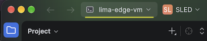
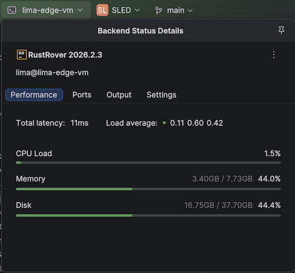

# Remote Development

>This is with Rust Rover. Other IDEs (Visual Code) would work differently.


## Requirements

- Direct `ssh` access

	IntelliJ Remote Development cannot (as of Aug'26) pick up the `~/.lima/$(VM_NAME)/ssh.config` configurations that Lima VM automatically does (HINT: It would be great if it did!). This is why our `Makefile` has bound them to your main `~/.ssh/config`.

	You should be able to:

	```
	% ssh lima-edge-vm
	Last login: Mon Aug 31 07:38:08 2026 from UNKNOWN
	lima@lima-edge3-vm:~$ 
	```

	This is a requirement for the IntelliJ Remote Development to work.

- Know the host-side ssh port

	Check the YAML for e.g. `localPort: 49925`
 

## Set up

<!-- *tbd. screenshots ... -->

- Within Rust Rover IDE
- `File` > `Remote Development`


	>Once set up, you will be able to click `SSH` and pick a suitable VM. But we need to set it up, first.
	
	- `New Connection`
	- "gear" icon next to the `Connection: <New Connection>`
	- `+`
	
	<!-- REALLY need screenshot here! -->
	
	- Fill in: 
		- `Host:` `lima-edge-vm`
		- `Port:` (the port in the YAML, e.g. `49925`)
		- `Username:` `lima` 
		- `Authentication type:` `OpenSSH config and authentication agent`

	- Press `Test Connection`

		If the test passes, press `OK`
	
	- Pick the created profile > `Check Connection and Continue`

	- Pick the remote IDE version (you could e.g. have stable and EAP, here)

	- `Project directory:` Choose by the `...` > `/home/lima/Some`

	- `Download IDE and Connect`

WHOA!!

The download is about 5GB. Let it roll..

>This is the reason for *reusing a VM* among multiple projects. IT'S HARD to get the Remote Development going, and each installation takes disk space.

Once installed, the user experience is familiar. You now have *two* IDEs open - you can actually close the original Rust Rover and just keep the Remote one open.


## Using

### Background

It's good for you to be aware the current - and the future - states that IntelliJ wants the Remote Development experience to be.

**Current**

There are three applications:

- Rust Rover IDE
- Gateway
- Rust Rover Remote

These show as separate icons on your macOS Dock.

The Remote Client **does not have feature parity** with the normal UI, or at least it has different bugs:

- Column editing mode does not work
- Dragging files to another window does not work

**Future**

The author understands IntelliJ is aiming at a more holistic approach, eventually. This might mean the remote aspects gets embedded in the main IDE, but this might be still some time off (2027).


### Hint: VM resources



You can tell the Remote IDE apart from the usual one by this drop-down menu.

Use it to have a glance at the resource usage of your VM:



### Hint: roles of the two IDE's

The two applications serve different purposes.

The remote one is great for managing builds and ...dare I say... debugging.

The local one is enough to manage editing of source files and `git` routines; e.g. comparing files and what not.

You might not need them both. It's perfectly fine to close the host-side, main IDE, once the remote IDE is running.
